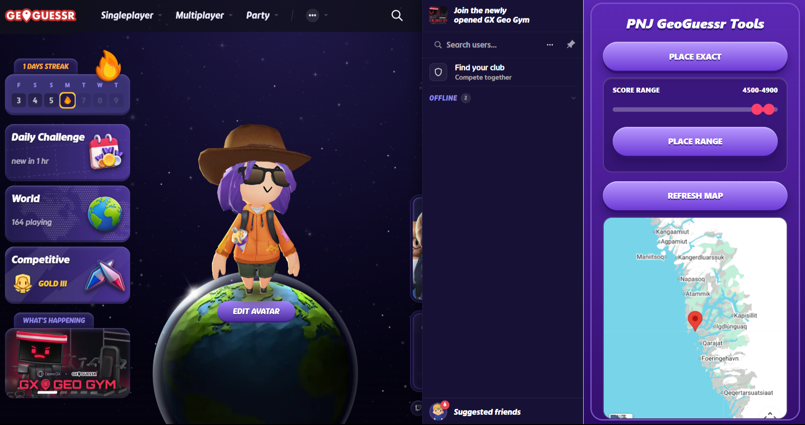
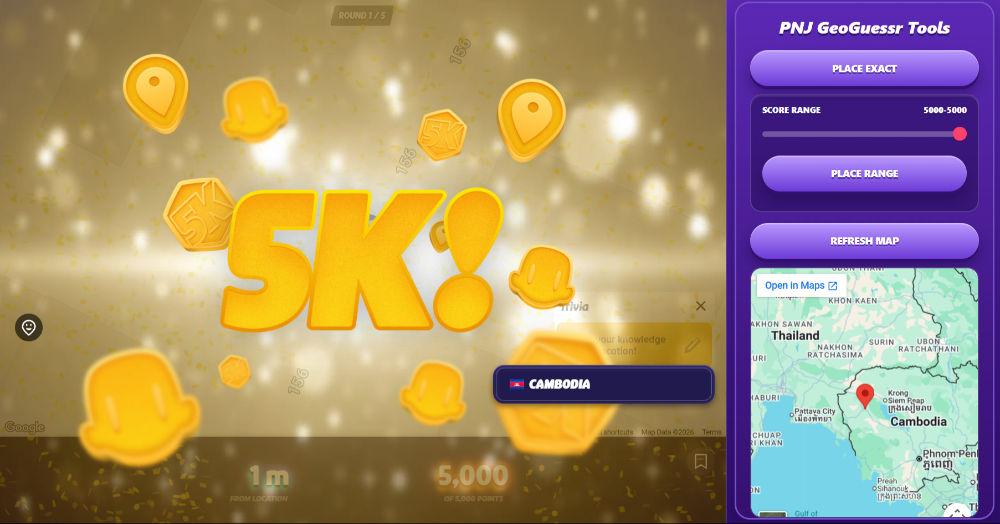
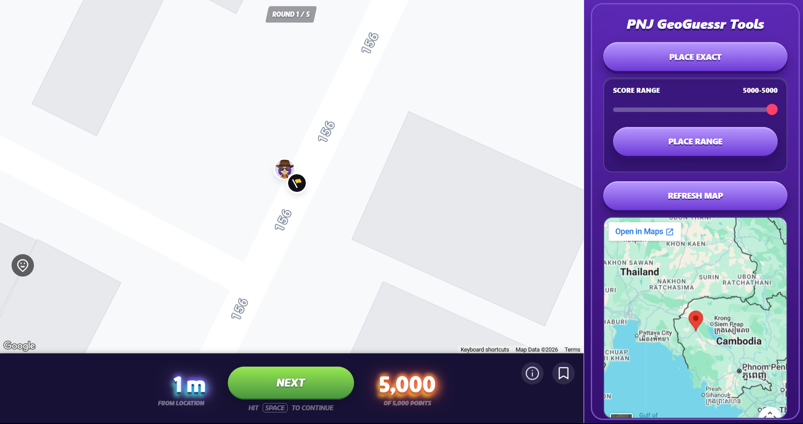
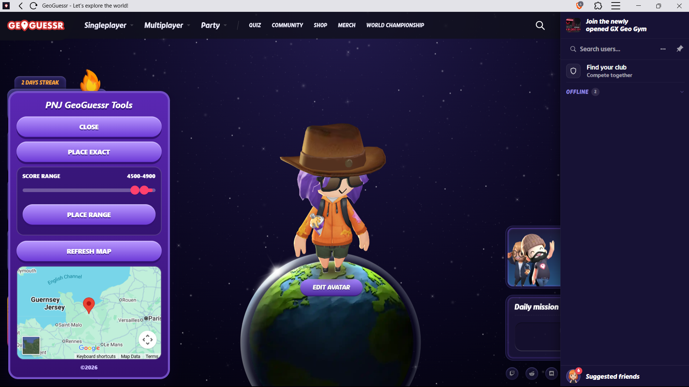

# PNJ GeoGuessr Tools

Chrome extension helper for GeoGuessr.

## Clone

```bash
git clone https://github.com/peenjeee/geoguessr-reverse-engineering.git
cd geoguessr-reverse-engineering
```

## Features

- Place exact
- Place nearby with an adjustable score range slider
- Refresh map preview for the current round location
- Browser side panel for normal Chrome/Brave tabs
- In-page launcher fallback for installed GeoGuessr PWA windows

## Auto-GeoGuessr Bot

Looking to automate your GeoGuessr farming? We have a companion Tampermonkey Userscript that clicks the PNJ buttons and cycles through rounds entirely on its own!

- **Farms EXP seamlessly** in the background.
- **Auto places the pin & guesses**.
- **Automatically plays the next round**.

[Download the Auto-GeoGuessr Userscript](https://github.com/peenjeee/auto-geoguessr)

## Preview










## PWA and Browser Modes

### Normal browser tab

When GeoGuessr is opened in Chrome or Brave as a normal tab, PNJ GeoGuessr Tools opens in the browser side panel.

### Installed PWA

When GeoGuessr is opened as an installed desktop PWA, the browser side panel may not be available. In that case, PNJ GeoGuessr Tools appears as an in-page PNJ launcher button.

### Fallback behavior

If the side panel cannot open, the extension automatically falls back to the in-page launcher.

## Install

1. Open `chrome://extensions`.
2. Enable Developer mode.
3. Click Load unpacked.
4. Select this project folder.
