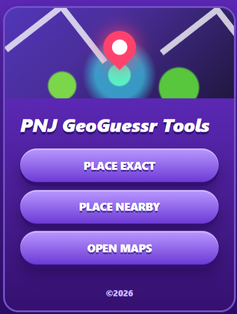
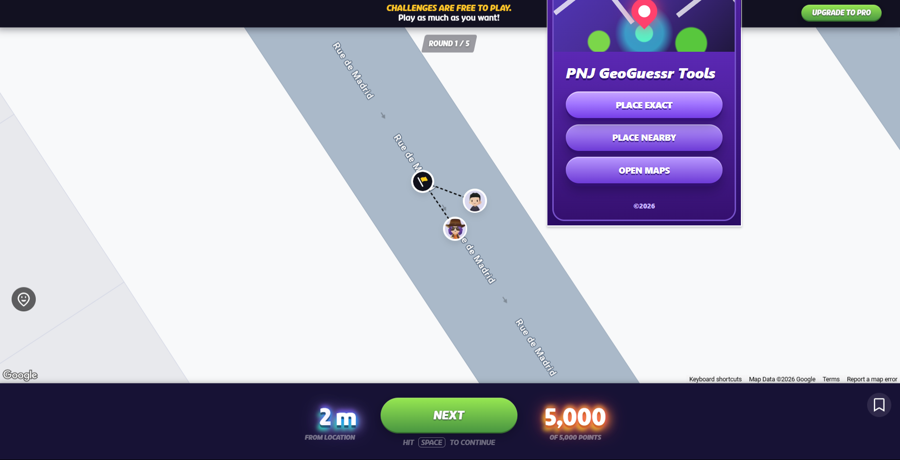
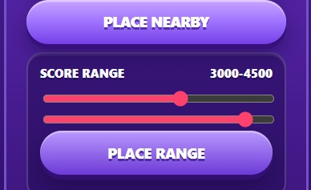
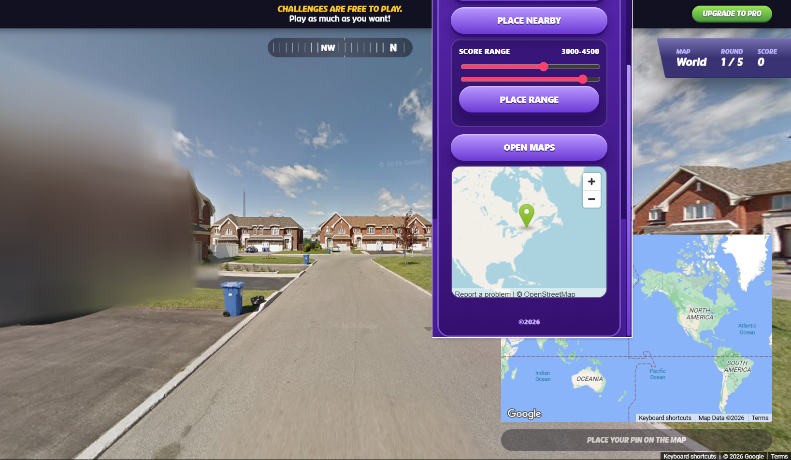

# PNJ GeoGuessr Tools

Chrome extension helper untuk GeoGuessr.

## Clone

```bash
git clone https://github.com/peenjeee/geoguessr-reverse-engineering.git
cd geoguessr-reverse-engineering
```

## Fitur

- Place exact
- Place nearby dengan slider range skor
- Open maps untuk lokasi ronde

## Tampilan



### Place exact



### Place nearby



### Open maps



## Install

1. Buka `chrome://extensions`.
2. Aktifkan Developer mode.
3. Klik Load unpacked.
4. Pilih folder project ini.
