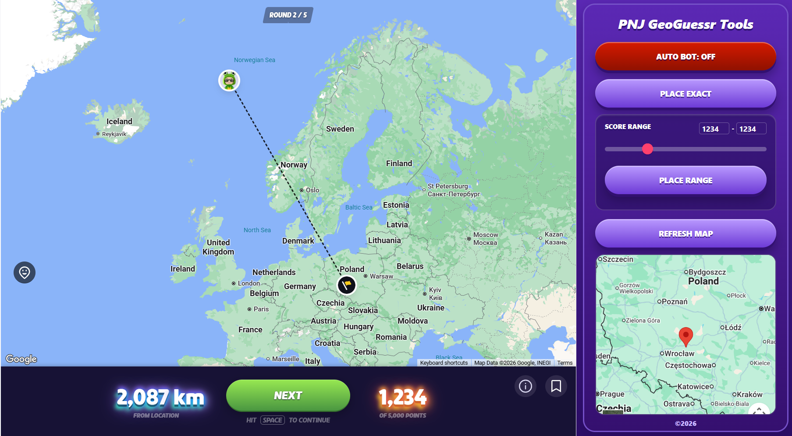
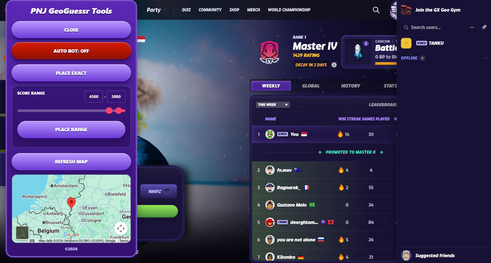

# PNJ GeoGuessr Tools

Chrome extension helper for GeoGuessr.

## Clone

```bash
git clone https://github.com/peenjeee/geoguessr-reverse-engineering.git
cd geoguessr-reverse-engineering
```

## Features

- **Copy ID**: Copy the browser `pnj_user_id` used by the PNJ web resolver. Use `Ctrl+Shift+C` for instant copy without opening the panel.
- **Live round telemetry**: Send the active round location to `http://localhost:3000/api/telemetry` and `https://gr.0xpnj.dev/api/telemetry`.
- **Built-in Auto Bot**: Farm EXP seamlessly in the background with auto-guess and auto-next round.
- **Place exact**: Drop the pin on the captured round location.
- **Place range**: Choose a score range (0 - 5000) and place close enough.
- **MapLibre GL / MapCN Engine**: Smooth light vector map preview.
- **Browser side panel**: For normal Chrome/Brave tabs.
- **In-page PWA launcher**: Fallback for installed GeoGuessr PWA windows.
- **Panel hotkey**: Press `Insert` to open or close the browser side panel. In PWA mode, press `Delete` to show or hide the in-page panel.

## Related Projects

- [https://gr.0xpnj.dev](https://gr.0xpnj.dev) - PNJ web resolver tools for showing round maps and location details from a copied ID.
- [https://github.com/peenjeee/auto-geoguessr](https://github.com/peenjeee/auto-geoguessr) - Tampermonkey userscript version.
- [https://gc.0xpnj.dev](https://gc.0xpnj.dev) - free GeoGuessr challenge links.

## Preview







## PWA and Browser Modes

### Normal browser tab

When GeoGuessr is opened in Chrome or Brave as a normal tab, PNJ GeoGuessr Tools opens in the browser side panel.

### Installed PWA

When GeoGuessr is opened as an installed desktop PWA, the browser side panel may not be available. In that case, PNJ GeoGuessr Tools appears as an in-page PNJ launcher button.

Press `Delete` to show or hide the PWA panel.

### Hotkeys

- `Insert`: Open or close the browser side panel in normal tabs.
- `Delete`: Show or hide the in-page panel in installed PWA mode.
- `Ctrl+Shift+C`: Copy your user ID instantly without opening any panel (shows toast notification). Then open https://gr.0xpnj.dev in any device to get round location

### Fallback behavior

If the side panel cannot open, the extension automatically falls back to the in-page launcher.

## Install

1. Open `chrome://extensions`.
2. Enable Developer mode.
3. Click Load unpacked.
4. Select this project folder.
